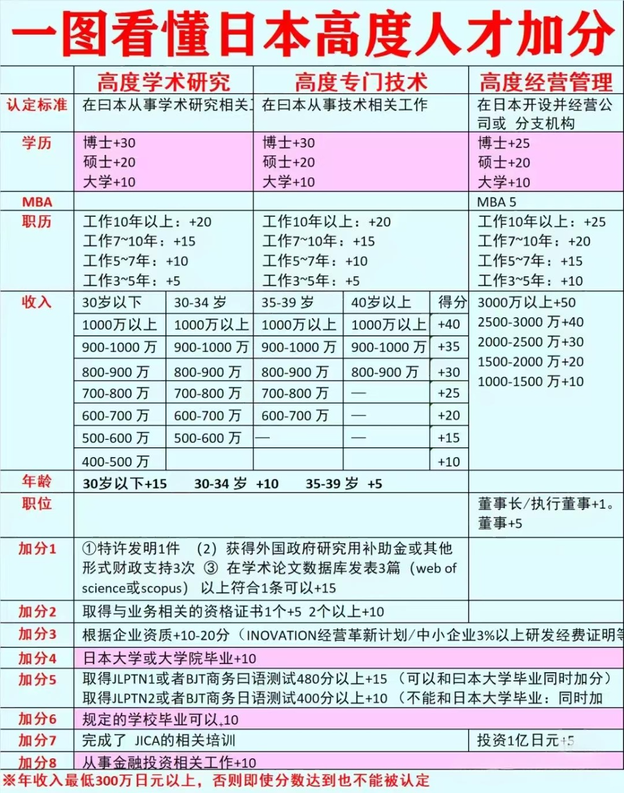

# 分类施工中

# 中国香港

## 概况
去香港工作/读书首先拿到的是“香港居民身份证”  
在香港呆满7年，才能成为“香港永久居民”，并换香港护照

“香港永久居民”这个身份对于不想失去中国国籍的人来说用处很大，可以参考这个[知乎回答](https://www.zhihu.com/question/462421370/answer/2195778770)

## 优才计划

一个香港推出的希望吸引高技术人才的计划，最近几年一直在放宽限制，拿到这个签证后可以直接去香港本地自由找工作，也不用和某个雇主绑定。

具体的打分链接[点这里](https://www.immd.gov.hk/hks/services/visas/quality-migrant-admission/self-assessment-tool.html)

注意点：
- 80分就可以申请，但是不能保证获批。分数越高获批机会越大。
- 第一次激活签证是2年的有效期，然后每一次续签是续签3年，在续签满7年的时候就可以申请转永久居民。
- 假如拿到这个签证后人一直不在香港工作，后续的续签时和转永久可能不会通过

# 日本

## 概况

永驻：是指外国人在日本永久居住的权利，类型其他国家的PR。  
普通人申请永驻要求在日本连续居住10年以上

归化： 加入日本国籍，换日本护照。在日本连续居住5年以上。

## 高度人才
日本人因为人口老龄化，吸引新移民搞的一个积分表，当满足条件后可以快速获得永驻。  
名字叫高级人才，实际上要求并不算很高。  

### 高度人才打分表

重点：  
得分超过70分，在工作三年后，且收入达到400万日元/年可申请永驻。  
得分超过80分，仅需工作一年时间后即可申请永驻。  

部分公司存在签证加分机会。一些招聘帖表明这些公司可以额外为高度人才签证+20分。

